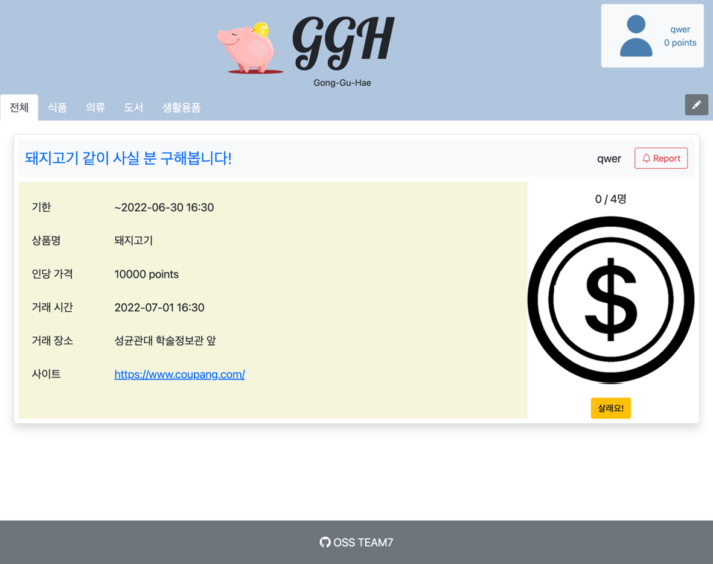
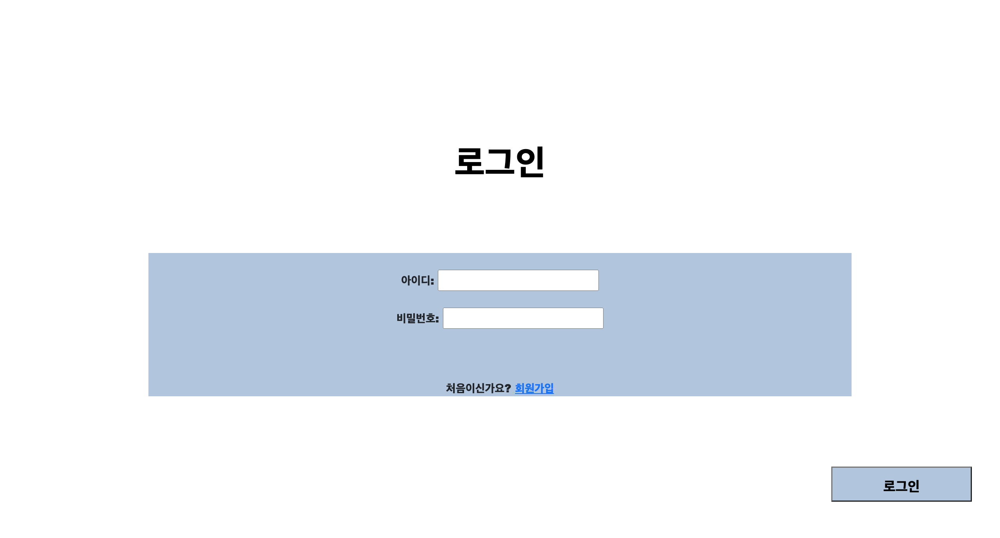
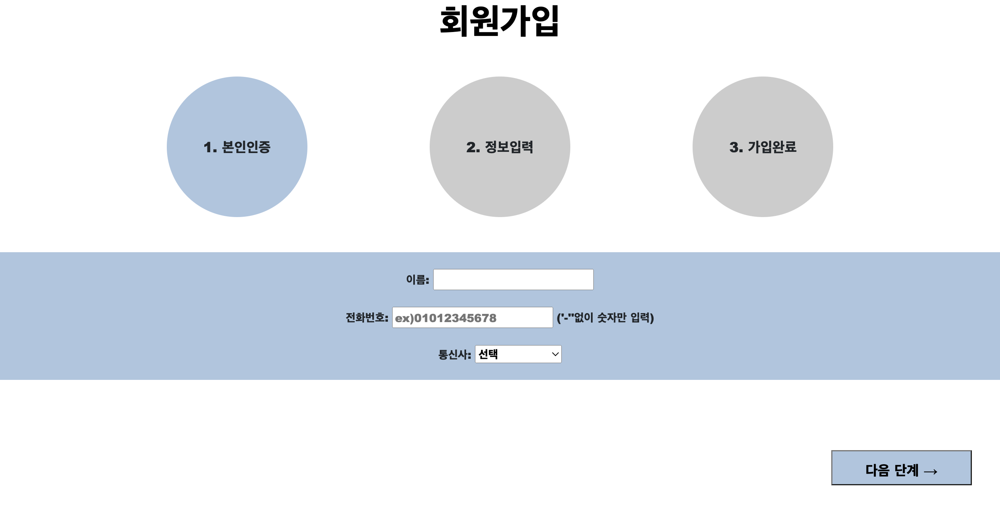
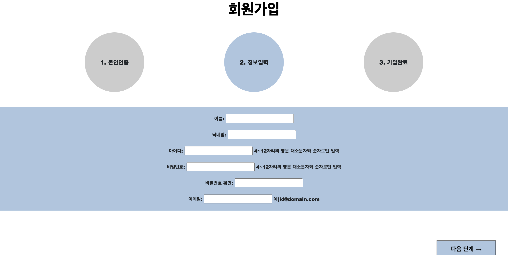
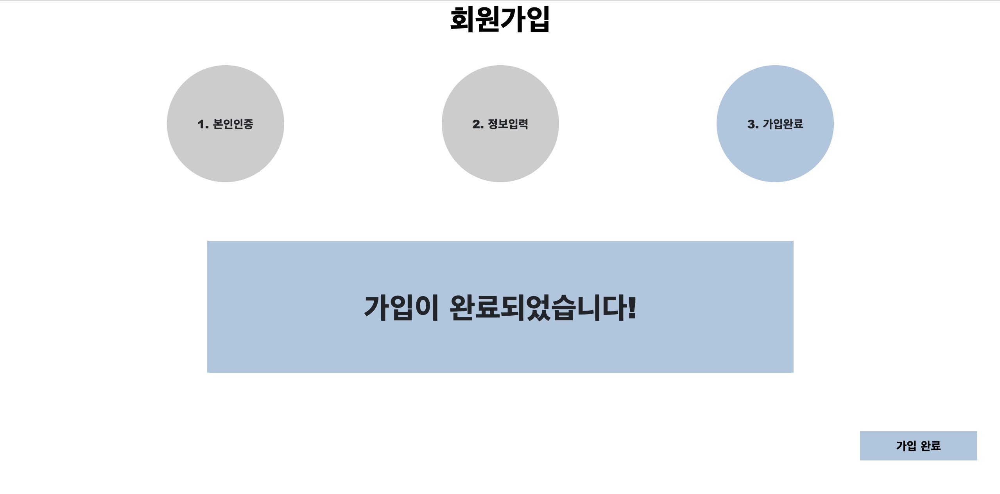
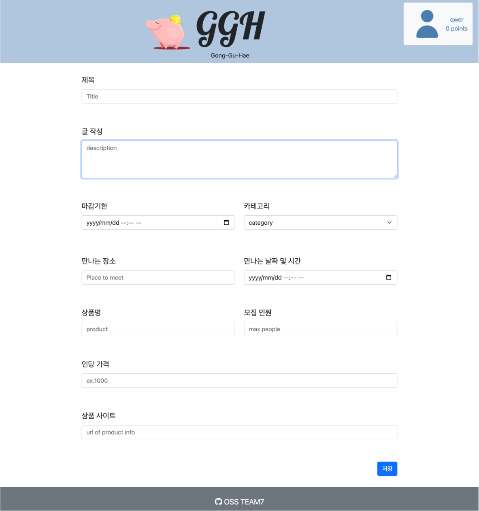
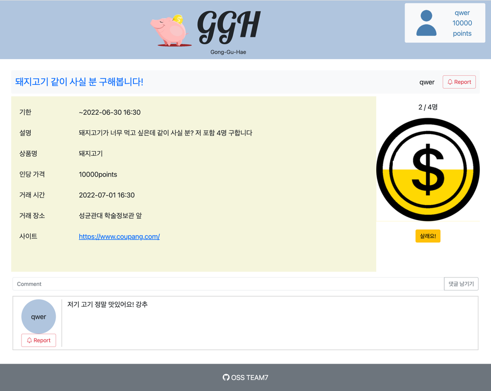

# GGH(공구해)

어떤 물건을 공동으로 구매(이하 공동구매)할 수 있는 기능을 지원하는 웹페이지이다.

## 설명

기존에 공동구매를 할 때, 사람을 모으기 힘들다는 것과 돈을 주고 받을 때 신뢰가 가지 않는다는 문제점이 있다.

'GGH' 사이트는 구매를 원하는 사람이 게시물을 올려 구인 후 구매를 진행한다.
 1. 게시물을 올리면 저금통 기능을 하는 동전 그림이 나타남
 2. '살래요!' 버튼을 누르면 자신의 포인트를 저금통에 채우고 공동구매에 참여 완료
 3. 목표 인원이 모두 모이면 모집 종료
 4. 모집 종료 후 게시글 작성자에게 개별 연락
 5. __게시글 주인이 불법을 저지르면 공동구매 참여자가 신고 가능__

'GGH' 사이트는 다음과 같은 기능을 제공한다.
 * 로그인 / 회원가입 기능
 * 회원가입과정 중 신원 확인 기능
 * 포인트 충전 기능
 * 게시판 글 작성 기능
 * 댓글 작성 기능
 * 사용자 신고 기능

## 장점

 * 편리한 구인 및 구매 진행
 * 신고 기능으로 사기 방지

## 스크린샷

홈페이지

로그인 페이지

회원가입 페이지

게시글 작성 페이지

게시글 페이지

## 버전

v 1.0.0
* 기능 구현 및 기초 디자인   

v 1.1.0
* 기능 개선 및 디자인 수정
